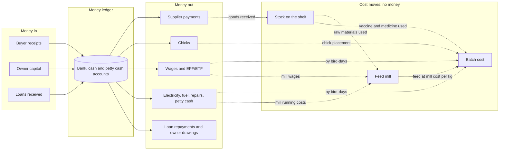
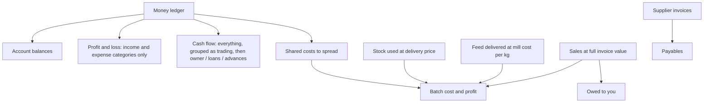

# The money map

One page on how money and cost move through FarmFlow.

## Every money line carries

| Label | Answers | Examples |
|---|---|---|
| **Account** | Which pocket? | Main Current Account, Cash Safe, Petty Cash |
| **Category** | What for? | Bird Sales, Day-old Chicks, Wages & Salaries |
| **Cost centre** | Where does it belong? | Main Farm, Expansion 1, Feed Mill, Admin (and a batch, where it applies) |
| **Document** | What proves it? | Sale, purchase order, payroll, petty cash claim |
| **Who** | Who entered and approved it? | Audit trail |

## Two kinds of movement

**Money moves** change a bank or cash balance. They go in the **ledger**.
**Cost moves** shift value from the shelf to a batch. No money changes hands. They go in the **batch's costs**.

## What each report adds up

## Categories

| Type | In the profit & loss? | Categories |
|---|---|---|
| **Income** | Yes | Bird Sales · Other Farm Income (manure, litter, scrap) · Interest Income · Other Income |
| **Expense** | Yes | Day-old Chicks · Feed Raw Materials · Purchased Feed · Medicine & Vaccines · Vet Services · Litter & Bedding · Farm Consumables · Electricity · Fuel & Gas · Water · Repairs & Maintenance · Equipment Purchase · Transport & Logistics · Wages & Salaries · EPF / ETF Contributions · Staff Welfare · Professional Fees · Bank Charges · Rent & Lease · Insurance · Office & Administration · Taxes & Licenses · Loan Interest · Other Expenses |
| **Financing** | No (cash flow only) | Owner Capital Introduced · Owner Drawings · Loan Received · Loan Principal Repayment · Customer Advances · Staff Advances & Loans · EPF Withheld from Staff |
| **Transfer** | No | Internal Transfer |
| **Needs review** | No | Uncategorized (should always be empty) |

## The rules

1. **Balances are added up, never typed.** Opening balance + in − out.
2. **Posted lines aren't edited.** Wrong tag: re-tag. Wrong amount: reverse and re-enter.
3. **Owner money and loan principal are never profit or cost.** Only loan interest is a cost.
4. **Only net pay leaves the bank,** but the ledger shows the full wage, the EPF held back and any advance recovered.
5. **Stock carries its own price.** Each delivery keeps its cost; the soonest-expiring is used first.
6. **Feed is charged to a batch at what it really cost the mill:** materials per kg + the mill's monthly running cost per kg.
7. **Shared costs are split by bird-days.** A farm's costs across that farm's batches; admin costs across all batches; mill costs into feed.
8. **Profit & loss counts money when it moves. A batch counts what it earned and used.** They agree once buyers have paid and stock bought has been used.
9. **Over-limit spending waits** for someone else to approve, and isn't counted until they do.
10. **Closed batches and locked months are frozen.**

## Where to look

| Question | Screen |
|---|---|
| How much cash do we have? | Home, or Money → Accounts |
| What was this money for? | Money → Ledger |
| Did we make money this month? | Money → Profit & loss |
| Why did cash change? | Money → Cash flow |
| Did this batch make money? | Farms → batch → Performance & profit |
| What does feed cost us per kg? | Reports → Cost Allocation; Feed mill → Production → Cost Breakdown |
| Who owes us? | Sales → Owed to you |
| Whom do we owe? | Money → Payables |
| What do we owe the bank? | Money → Owner & loans |
| What's waiting for me? | Approvals |
